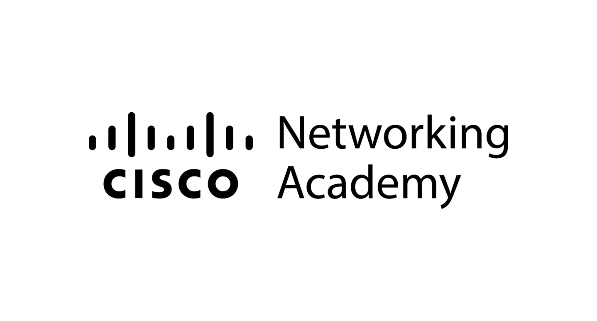

# 🧠 Cisco Networking Academy Solutions

## 📋 Introduction

This repository is my personal space for storing and collecting various projects that I've practiced and built while learning through [Cisco Networking Academy](https://www.netacad.com/). Its primary goal is to track my development, showcase my skills, and share my unique problem-solving approaches. Please note, this repository does NOT contain all content from [Cisco Networking Academy](https://www.netacad.com/).

### 🎯 Purpose & Goals
This repository is designed to help me:

* Track Progress — To monitor my development in problem-solving and technical skills.
* Deepen Understanding — To enhance my understanding of hardware-focused programmer career paths related to [networking](https://www.netacad.com/catalogs/learn).
* Interview Preparation — To strengthen my skills for technical interviews.
* Share Knowledge — To contribute to the broader programming community.

---

## 💡 How to Explore

Follow these simple steps to navigate through the solutions:

### Step 1: Select a Category

Browse the [Table of Contents](#-table-of-contents) to find categories.

### Step 2: Choose a Project

Each entry provides essential information:

* Project Name — A direct link to the project on [Cisco Networking Academy](https://www.netacad.com/).
* Description — A brief summary of what you'll find in that project.
* Focus Point — The main programming languages, tools, or key concepts reinforced by the project.
* Directory Link — Click "Open" to navigate directly to the project's directory, which contains the code and related files.

### Step 3: Explore the Code and Solutions

Inside each project directory, you'll find the code files and potentially a README.md that provides further details about my problem-solving approach.

---

## 📁 Table of Contents

This Table of Contents primarily covers [Career Paths](https://www.netacad.com/catalogs/learn?category=career-path), but there's much more to learn on [Cisco Networking Academy](https://www.netacad.com/), such as specialized programming languages. If you're interested, [click here](https://www.netacad.com/catalogs/learn?category=course).

### Main Categories

* 📂 [Junior Cybersecurity Analyst](#-junior-cybersecurity-analyst)
* 📂 [Network Technician](#-network-technician)

> Note: This repository represents a curated selection of [career paths](https://www.netacad.com/catalogs/learn?category=career-path) and doesn't encompass the entire [Cisco Networking Academy](https://www.netacad.com/) platform.

---

## 📂 Junior Cybersecurity Analyst

Below is a list of all Junior Cybersecurity Analyst projects available in this repository.

| Project Name | Description | Focus Point | Directory |
| :------------------------- | :------------------------------------------------------------------------------------------------------------------------------------------------------------------------------------------- | :---------------------------------- | :---------------------- |
| | | |

You can [click here](./junior-cybersecurity-analyst) to see more Junior Cybersecurity Analyst projects.

## 📂 Network Technician

Below is a list of all Network Technician projects available in this repository.

| Project Name | Description | Focus Point | Directory |
| :------------------------- | :------------------------------------------------------------------------------------------------------------------------------------------------------------------------------------------- | :---------------------------------- | :---------------------- |
| | | |

You can [click here](./network-technician) to see more Network Technician projects.

---

### 🙏 Thank You, [Cisco Networking Academy](https://www.netacad.com/)

I want to express my sincere gratitude to [Cisco Networking Academy](https://www.netacad.com/) for their excellent learning platform, quality courses, and the opportunity to further develop my networking-related skills and understanding. The knowledge and experience gained from [Cisco Networking Academy](https://www.netacad.com/) have significantly contributed to creating these projects and developing my technical abilities.